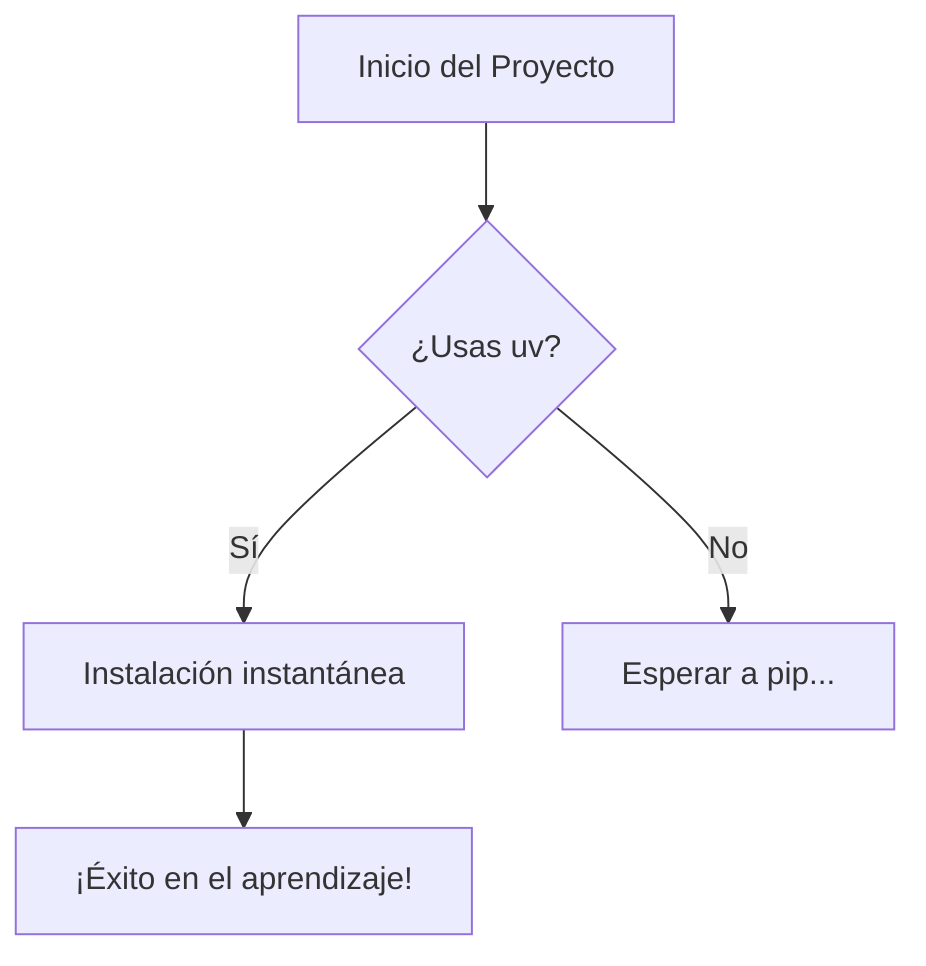

## 1. Notación Matemática ($\LaTeX$)
Verifica que las fórmulas se rendericen elegantemente.

**Fórmula en línea:** La distribución normal se define como $f(x) = \frac{1}{\sigma\sqrt{2\pi}} e^{-\frac{1}{2}\left(\frac{x-\mu}{\sigma}\right)^2}$.

**Bloque de ecuación:**
$$
\int_{-\infty}^{\infty} e^{-x^2} dx = \sqrt{\pi}
$$

---

## 2. Código de Programación
Prueba del resaltado de sintaxis, títulos de archivo y botones de copiado.

```python title="analisis_datos.py" hl_lines="2 5"
import numpy as np

def calcular_media(lista):
    """Calcula la media aritmética de una lista."""
    resultado = np.mean(lista)
    return resultado

datos = [10, 20, 30, 40, 50]
print(f"La media es: {calcular_media(datos)}")

```

---

## 3. Cajas de Contenido (Admonitions)

Estas cajas son esenciales para que tu contenido sea "atractivo" y organizado.

!!! info "Información"
Este es un bloque informativo para datos generales.

!!! danger "Cuidado con el Teorema"
No olvides verificar que las condiciones de frontera se cumplan antes de integrar.

!!! example "Ejercicio Resuelto"
Este es un bloque de ejemplo. Puedes usarlo para proponer retos al lector.

---

## 4. Diagramas con Mermaid

Si configuraste `superfences` correctamente, deberías ver un diagrama de flujo aquí:



---

## 5. Elementos de Interfaz Especiales

### Pestañas de contenido (Content Tabs)

Ideal para mostrar el mismo concepto en diferentes lenguajes o niveles.

=== "Python"

    ```python
    print("Hola Mundo")
    ```

=== "C++"

    ```cpp
    std::cout << "Hola Mundo" << std::endl;
    ```

=== "Matemáticas"

    $$ f(x) = x^2 $$

### Detalles plegables

Para ocultar soluciones o contenido extenso:

???+ tip "Haz clic para ver un consejo oculto"
    ¡Puedes usar iconos de Material Design en cualquier parte! :material-rocket-launch: :material-variable:

---

## 6. Listas de Tareas

* [x] Configurar `mkdocs.yml`
* [x] Instalar dependencias con `uv`
* [ ] Escribir mi primera lección real

